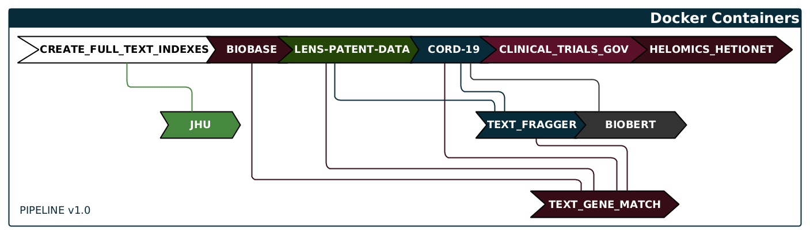

import Mermaid from '@theme/Mermaid'

## motherlode
Motherlode is a special repository that manages the pipeline designed to run all of the data loading docker images and scripts in a controlled manner, resolving data loader dependencies, keeping track of which data loaders are already in the graph and tracking versions. The most up-to-date list of docker images and dependencies can always be found in [pipeline.yaml](https://github.com/covidgraph/motherlode/blob/master/pipeline.yaml)

<Mermaid chart={`
  flowchart LR
    PL("pipeline.yaml")-->motherlode
    DAPI("Docker API Point/Socket")-->motherlode
    CG[("CovidGraph")]
    ADL("Any Data Loader")
    SDT("Some Data Transformer")
    ODL("Other Data Loader")
    ADE("Any Other Data Enricher")
    SDA("Some Data Analyser")     
    motherlode-->CG  
      subgraph motherlode
        ADL-.->SDA
        SDA
        SDT-.->ADE
        ODL-.->ADE
        ADE-.->SDA
      end
    `}/>

<Mermaid chart={`
  flowchart LR
    PL("pipeline.yaml")-->motherlode
    DAPI("Docker API Point/Socket")-->motherlode
    CG[("CovidGraph")]
    FTI{{"full-text-indexes"}}
    JHU{{"data_population_jhu"}}
    BioB{{"data_biobase"}}
    TGM{{"text-gene-match"}}
    Lens{{"lens-patent-data"}}
    C19{{"data-cord19"}}
    TF{{"text-fragger"}}
    CT{{"clinical-trials-gov"}}
    Bert{{"BioBert"}}
    motherlode-->CG  
      subgraph motherlode
        FTI-.->JHU
        BioB-.->TGM
        Lens-.->TGM
        Lens-.->TF
        C19-.->TGM
        C19-.->TF
        C19-.->Bert
        TF-.->TGM
        CT        
      end
    `}/>
